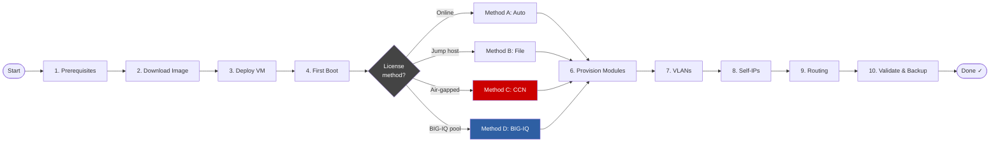

# BIG-IP VE — Customer Getting Started Guide

> **From download to first virtual server** — a complete guide for customers new to F5 BIG-IP Virtual Edition on on-premises hypervisors.

---

## Who this guide is for

Infrastructure engineers and architects deploying BIG-IP Virtual Edition (VE) for the first time on an on-premises or private-cloud hypervisor. It assumes working hypervisor admin knowledge but **no prior BIG-IP experience**.

For public cloud deployments (AWS, Azure, GCP), see the [F5 CloudDocs public cloud index](https://clouddocs.f5.com/cloud/public/v1/index.html) instead.

---

## Deployment workflow



---

## Guide structure

Work through these in order. Each is a standalone document in [`docs/`](./docs/).

| Step | Document | Est. time |
|------|----------|-----------|
| 1 | [Prerequisites & Minimum Requirements](./docs/01-prerequisites.md) | 10 min |
| 2 | [Downloading the BIG-IP VE Image](./docs/02-download.md) | 10 min |
| 3 | [Deploying the VM](./docs/03-deploy.md) | 15–30 min |
| 4 | [First Boot & Initial Setup](./docs/04-first-boot.md) | 10 min |
| 5 | [Licensing](./docs/05-licensing.md) | 5–15 min |
| — | &nbsp;&nbsp;↳ [Method A: Automatic (online)](./docs/licensing/method-a-automatic.md) | |
| — | &nbsp;&nbsp;↳ [Method B: Manual (file-based)](./docs/licensing/method-b-manual.md) | |
| — | &nbsp;&nbsp;↳ [Method C: CCN Self-Service (air-gap)](./docs/licensing/method-c-ccn.md) | |
| — | &nbsp;&nbsp;↳ [Method D: BIG-IQ Pool (unreachable device)](./docs/licensing/method-d-bigiq-pool.md) | |
| 6 | [Module Provisioning](./docs/06-provisioning.md) | 5 min |
| 7 | [VLAN Configuration](./docs/07-vlans.md) | 10 min |
| 8 | [Self-IP Addresses](./docs/08-self-ips.md) | 5 min |
| 9 | [Default Route & Static Routes](./docs/09-routing.md) | 5 min |
| 10 | [Save & Validation Checklist](./docs/10-validation.md) | 5 min |
| — | [Quick-Start Cheat Sheet](./docs/quick-start.md) | Reference |
| — | [Troubleshooting](./docs/11-troubleshooting.md) | Reference |
| — | [Next Steps](./docs/12-next-steps.md) | Reference |

---

## Experienced user?

Go straight to the **[Quick-Start Cheat Sheet](./docs/quick-start.md)** for the minimal TMSH command sequence.

---

## Hypervisor coverage

| Hypervisor | Covered | Image format | F5 CloudDocs |
|------------|---------|--------------|--------------|
| VMware ESXi (vSphere 6.7+) | ✅ | `.ova` | [vmware_index](https://clouddocs.f5.com/cloud/public/v1/vmware_index.html) |
| Linux KVM / Proxmox VE | ✅ | `.qcow2` | [kvm_index](https://clouddocs.f5.com/cloud/public/v1/kvm_index.html) |
| Nutanix AHV (Prism Central) | ✅ | `.qcow2` | [nutanixAHV_index](https://clouddocs.f5.com/cloud/public/v1/nutanixAHV_index.html) |

---

## BIG-IP version coverage

Applies to BIG-IP VE **15.x, 16.x, and 17.x**. Always cross-check hypervisor compatibility against the [BIG-IP VE Supported Platforms matrix](https://clouddocs.f5.com/cloud/public/v1/matrix.html) before deploying. Check [K5903](https://support.f5.com/csp/article/K5903) for the support lifecycle of your chosen version.

---

## Licensing paths covered

| Method | BIG-IP internet? | BIG-IQ needed? | When to use |
|--------|-----------------|----------------|-------------|
| A — Automatic (online) | ✅ Yes | ❌ No | Internet-connected environments |
| B — Manual (file-based) | ❌ No | ❌ No | Jump host can reach F5 portal; BIG-IP cannot |
| C — CCN Self-Service | ❌ No | ❌ No | True air-gap; requires F5 CCN pre-approval |
| D — BIG-IQ Pool | ❌ No (BIG-IP) | ✅ Yes | BIG-IQ connected; BIG-IP isolated |

---

## Repository layout

```
bigip-ve-getting-started/
├── README.md
├── CONTRIBUTING.md
├── CHANGELOG.md
├── .gitignore
├── .github/
│   └── workflows/
│       └── link-check.yml
├── scripts/
│   └── ccn-licensing/
│       ├── README.md
│       ├── regkey-pool-license.py               ← Python 2 (run on BIG-IQ)
│       ├── regkey-pool-license-py3.py            ← Python 3 (run on jump host)
│       ├── lic-data.json.example
│       └── lic-data.json.example-with-optional-fields
└── docs/
    ├── quick-start.md
    ├── 01-prerequisites.md
    ├── 02-download.md
    ├── 03-deploy.md
    ├── 04-first-boot.md
    ├── 05-licensing.md               ← licensing method selector
    ├── licensing/
    │   ├── method-a-automatic.md
    │   ├── method-b-manual.md
    │   ├── method-c-ccn.md
    │   └── method-d-bigiq-pool.md
    ├── 06-provisioning.md
    ├── 07-vlans.md
    ├── 08-self-ips.md
    ├── 09-routing.md
    ├── 10-validation.md
    ├── 11-troubleshooting.md
    └── 12-next-steps.md
```

---

## Contributing

See [CONTRIBUTING.md](./CONTRIBUTING.md).

---

*Maintained by the F5 Federal Solutions Engineering team. Not an official F5 product document.*
